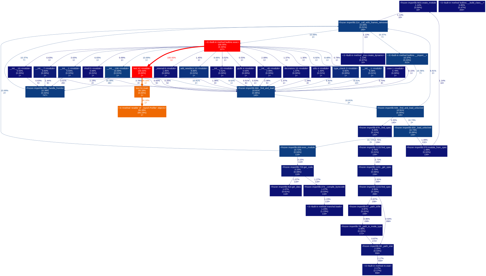

# Python profiling
<br>


---

####  [Using %timeit in iPython / Jupyter notebook](#timing)
####  [SnakeViz graphical viewer](#snake)
####  [cProfile](#Cprofile)
####  [gprof2dot callgraph](#GPROF)
####  [pycallgraph callgraph](#PYCALLG)
####  [Line profiler](#linepro)
####  [Flamegraph](#flame)


---


<br>


```python
import sys
sys.version_info
```


sys.version_info(major=3, minor=5, micro=2, releaselevel='final', serial=0)

<br>
<br>
<br>

---

#### <a id='timing'>Using %timeit in iPython / Jupyter notebook</a>


```python
"""
iPython magic functions
%timeit (line mode) and %%timeit (cell mode)

ipython.readthedocs.io/en/stable/interactive/magics.html
"""
```

<br>
<br>

```python
%timeit range(1000)
range(1000)         # this line is not timed !!!!
```

  394 ns ± 27 ns per loop (mean ± std. dev. of 7 runs, 1000000 loops each)

  range(0, 1000)


<br>
<br>


```python
%%timeit -o
range(1000)
range(1000)
```

  788 ns ± 3.33 ns per loop (mean ± std. dev. of 7 runs, 1000000 loops each)

  <TimeitResult : 788 ns ± 3.33 ns per loop (mean ± std. dev. of 7 runs, 1000000 loops each)>


```python
result = _
result.average
```


  7.882053699963958e-07


```python
vars(result)
```


   {'_precision': 3,
    'all_runs': [0.7886979641270093,
     0.7890277414581428,
     0.7918047432600925,
     0.7810769394164687,
     0.7879625472911407,
     0.7916713150841677,
     0.7871963393377488],
    'best': 7.810769394164688e-07,
    'compile_time': 0.00013208943168585563,
    'loops': 1000000,
    'repeat': 7,
    'timings': [7.886979641270093e-07,
     7.890277414581428e-07,
     7.918047432600925e-07,
     7.810769394164688e-07,
     7.879625472911407e-07,
     7.916713150841677e-07,
     7.871963393377488e-07],
    'worst': 7.918047432600925e-07}


<br>
<br>
<br>

---

#### <a id='snake'>SnakeViz graphical viewer</a>


```python
"""
jiffyclub.github.io/snakeviz/

command line usage:
    python -m cProfile -o example.prof  example.py
    snakeviz  example.prof


iPython magic %prun to profile a command and save to example.prof
    %prun -D  example.prof glob.glob('*.txt')
"""
```


```python
%load_ext snakeviz
import glob
%snakeviz glob.glob('*.txt')
```

<br>

SnakeViz then opens an interactive web page for visualizing the call stack.

<br>

     


<br>
<br>


```python
'''
Another example using %%snakeviz in cell mode (visualization not shown)
'''
import fnmatch, os
```


```python
%%snakeviz
for file in os.listdir('.'):
    if fnmatch.fnmatch(file, '*.txt'):
        print(file)
```


<br>
<br>
<br>


---

#### test.py


```python
import cProfile

def loop1(list1):
    for x in list1:
        list1[x] = x*x


# use @profile decorator with line profiler
#@profile
def main():    

    # comment out when using with python -m cProfile test.py
    cp = cProfile.Profile()
    cp.enable()

    for i in range(10000):
        list1 = [x for x in range(1000)]
        loop1(list1)    

    cp.disable()
    cp.print_stats()

if __name__ == '__main__':       
    main()
```

<br>
<br>
<br>


---

#### <a id='Cprofile'>cProfile</a>

[Python Profilers](http://docs.python.org/3.5/library/profile.html)

<br>

Profile using cProfile, and sort by total time spent in a function.

```python
python -m cProfile -s tottime test.py

"""
 or save results to a file test.prof

 python -m cProfile -o test.prof test.py

"""
```

     

<br>
<br>


Use cProfile.Profile() and print_stats() in test.py (see code above) to profile only part of the code.

```python
python test.py
```

     

<br>
<br>
<br>


---


#### <a id='GPROF'>gprof2dot callgraph</a>


[gprof2dot](http://github.com/jrfonseca/gprof2dot)

```python
python -m cProfile -o test.prof test.py
gprof2dot.exe -f pstats test.prof | dot -Tsvg -o gprof.svg
```

Open the svg file in a web browser.




<br>
<br>
<br>


---


#### <a id='PYCALLG'>pycallgraph</a>


[pycallgraph](http://pycallgraph.slowchop.com/en/master/index.html)


```
pycallgraph graphviz -- test.py
```
saves to pycallgraph.png

<br>


<br>
<br>
<br>

---

#### <a id='linepro'>Line profiler</a>


[Line profiler](https://github.com/rkern/line_profiler)

decorate each function to profile with @profile

```
kernprof -l -v test.py
```


     


<br>
<br>
<br>

---

#### <a id='flame'>Flamegraph</a>


[Python flamegraph](http://github.com/evanhempel/python-flamegraph)
<br>
[FlameGraph](http://github.com/brendangregg/FlameGraph)


uncomment any line profiler @profile decorators first      
```
python -m flamegraph -i 0.001 -o perf.log test.py
```

(On Windows, you need to convert perf.log from dos to unix line endings)
<br>
    vim:
        set ff=unix

You can edit perf.log to filter results.

```
FlameGraph-master/flamegraph.pl --title "test1" perf.log > perf.svg

(assumes location of flamegraph.pl is in FlameGraph-master folder of the current directory)
```

<br>

Open the svg in a web browser, and click on the events to zoom in or out.


This example is probably not the nicest looking flamegraph, but it does show that most of the time is
spent on the loop1 function followed by the list comprehension.
For a great explanation on flamegraphs, check out:
[speakerdeck.com/mrfoto/what-are-flame-graphs-and-how-to-read-them](http://speakerdeck.com/mrfoto/what-are-flame-graphs-and-how-to-read-them)

<br>
<br>
<br>
